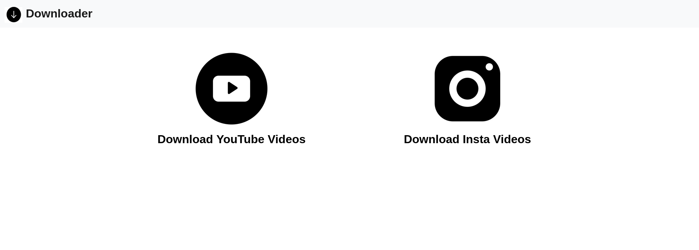

# ⬇️ Downloader

## About
It's a Instagram and Youtube videos downloading web app.




Its back and process is a web scraping using selenium webdriver. 
Scraping videos with the selenium webdriver from the URL provided by the customer. The scraped videos are saved on the server and returned to the users. 
Videos will be deleted after a certain period of time


## Installation
Instructions on how to install *Downloader*
```bash
git clone https://github.com/shihar73/Downloader.git
cd Downloader

```
create a new virtual environment
 ```
 python3 -m venv virtualenv
 ```
 install requirements.txt
 ```
 pip install requirements.txt 
 ```
 An Instagram account is a must if you want to scrape Instagram video so you want to save your Instagram username and password in a *.env* file.
 So creat a .env file
 ```
 sudo nano .env
 ```
 and add username and password
 ```
 INSTA_USER_NAME = your_username
 INSTA_PASS = your_password
 ```
Then you can start your server
## URL
https://downloader-insta-youtube.herokuapp.com

